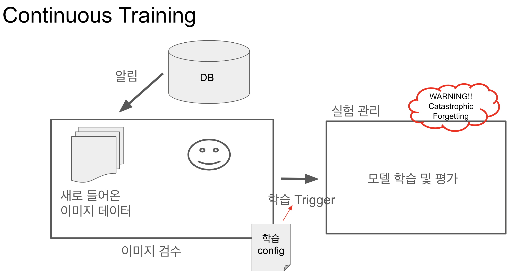

## Continuous ML

### 기능
- 이미지 데이터가 새로 추가됨에 따라 이미지 검수를 진행하고, 학습을 트리거함

시나리오
1. 데이터베이스에 이미지 추가됨
2. 이미지 검수(라벨링)
3. 재학습 트리거

#### 모델에 대한 추상화가 가져오는 장점
- 각 모델에 대한 형식을 직접 맞춰줘야한다는 단점이 있지만, 여러 모델에 대하여 실험을 할 때, 실험 결과를 한 번에 살펴보기 더 쉽고, 모델 서빙 형식을 보편화할 수 있다는 장점이 있다.

    
